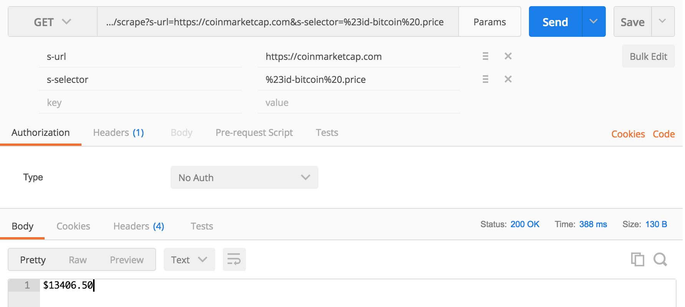
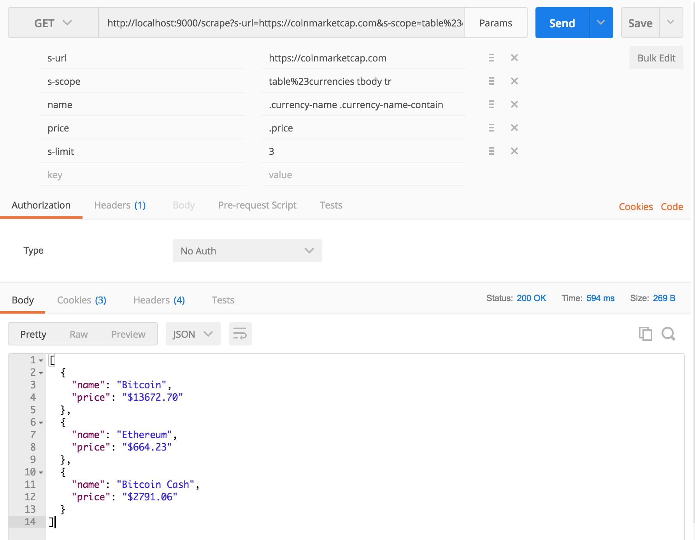

# scraper

An html scraper microservice based on x-ray & micro

[]()
[](https://travis-ci.org/gorillab/scraper)
[](https://github.com/gorillab/scraper)
[](https://github.com/gorillab/scraper)

## Features

- [x-ray](https://github.com/matthewmueller/x-ray): An html scraper
- [micro](https://github.com/zeit/micro): Asynchronous HTTP microservices
- [joi](https://github.com/hapijs/joi): Object schema validation

## Usage

**Request**

Send a `GET` request to `/scrape` endpoint with query string that contains:

| Params     | Required       | Description                                                      |
|------------|----------------|------------------------------------------------------------------|
| s-url      | yes            | destination website url to be scraped                            |
| s-selector | yes (if text)  | css selector of data to be extracted (text in result)            |
| s-scope    | yes (if array) | css selector of data's scope (array of objects in result)        |
| s-limit    | no (if array)  | limit number of objects are returned                             |
| [selector] | yes (if array) | css selector of data to be extracted                             |

**Response**

A text or an array of object in json whose keys are specified selectors in the request's query string.

### Examples

#### Getting Bitcoin price in USD from [coinmarketcap.com](CoinMarketCap)

- Request (uri encoded): `.../scrape?s-url=https://coinmarketcap.com&s-selector=%23id-bitcoin%20.price`
- Response: as shown below



#### Getting top 3 coins' price

- Request (uri encoded): `/scrape?s-url=https://coinmarketcap.com&s-scope=table%23currencies%20tbody%20tr&name=.currency-name%20.currency-name-container&price=.price&s-limit=3`
- Response: as shown below



## Development & deployment guide

### Getting started

Make sure [NodeJS](https://nodejs.org) (9.0.0 or newer), [Yarn](https://yarnpkg.com) or [NPM](https://npmjs.com) installed on your local machine. Then install project dependencies by running:

```bash
yarn
```

### Start developing

```bash
yarn start
```

The service will be up at `127.0.0.1:9000` by default

### Testing

We use ESLint to lint source code. Simply run:

```bash
yarn test
```

### Run on production mode

By the command:

```bash
PORT=80 yarn serve
```

The app will be up at `127.0.0.1`

### Using Docker image

You can use the existing docker image from https://hub.docker.com/r/gorillab/scraper by running:

```bash
docker pull gorillab/scraper
docker run -d -p 80:80 gorillab/scraper
```

The app will be up at `127.0.0.1`

### Deploy to Heroku

Click the below button to deploy to Heroku dyno

[](https://heroku.com/deploy)

## Contributing

1. Fork this repository to your own GitHub account and then clone it to your local device
2. Follow the Development guide or just simply run: yarn start
3. Lint code by running: yarn test
4. Create a pull request for us

## Contributing

* Phat Pham ([@phatpham9](https://github.com/phatpham9)) - [Gorillab](https://github.com/gorillab)
